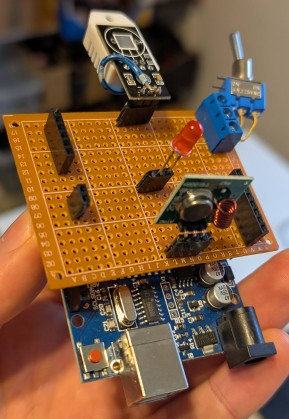

# Diesel Heater 433 MHz Remote Control

This project is based on [ChilliChump`s Project](https://github.com/ChilliChump/Diesel-Heater-433mhz-Remote-Control). 

Its goal is to control a diesel heater to be a frost guard.

The states are as follows:

It is done with an Arduino, DHT22 (temperature sensor) and a 433MHz Transmitter.
We sniff and use the protocoll of the original remote control of the heater.

I use the very nice [Arduino Extension for VSCode](https://github.com/microsoft/vscode-arduino), sadly it is deprecated...

## Projectplan / To-do:

- [X] Basic 433MHz Send & Receive Test
- [X] Sniff Remote Control Codes
- [X] DHT22 integration & test
- [X] Programming
- [X] Design Circuit Board 
- [X] Build Circuit Board
- [X] Final Tests
- [ ] Integration

## Basic 433Mhz Send & Receive Test

You can install the [rc-switch library](https://docs.arduino.cc/libraries/rc-switch/) in the library manager of the [Arduino IDE](https://www.arduino.cc/en/software). 

Then the ReceiveDemo_Advanced and the SendDemo can be found under "Examples" in the IDE. Just load it on two separate Microcontrollers and open the serial monitor on the receiving one with baudrate 9600. You should now see the received data which was sent from the transmitting Microcontroller.

## Sniffed Remote Control Codes

I used [the receive demo advanced example script](https://github.com/sui77/rc-switch/tree/master/examples/ReceiveDemo_Advanced) to sniff the remote control codes:

### Chinese Diesel Heater Protocol

#### On:
Decimal: 2794262960 (32Bit) 

Binary: 10100110100011010001000110110000 

Tri-State: not applicable 

PulseLength: 257 microseconds 

Protocol: 1

#### Off:
Decimal: 2794259720 (32Bit) 

Binary: 10100110100011010000010100001000 

Tri-State: not applicable 

PulseLength: 257 microseconds 

Protocol: 1

#### +:
Decimal: 2794260720 (32Bit) 

Binary: 10100110100011010000100011110000 

Tri-State: not applicable 

PulseLength: 257 microseconds 

Protocol: 1

#### -:
Decimal: 2794259080 (32Bit) 

Binary: 10100110100011010000001010001000 

Tri-State: not applicable 

PulseLength: 256 microseconds 

Protocol: 1

## DHT22 Test

The DHT22 can be tested with the [Unified Sensor Example](https://github.com/adafruit/DHT-sensor-library/tree/master/examples/DHT_Unified_Sensor). 

You can install the [DHT sensor library](https://docs.arduino.cc/libraries/dht-sensor-library/) in the library manager. Then the DHT_Unified_Sensor example can be found under "Examples" in the IDE. Just load in on the Microcontroller and open the serial monitor with baudrate 9600. You should see actual temperature and humidity in the serial monitor.

## Schematic

## Built Project

## Serial Interface

### Admin Mode

Connect to the Microcontroller via serial Inferface:

- Baudrate: 115200
- No line endings!

Then enter "Admin" and send as plain UTF-8 characters.

You can now do the following:

1) Switch On
2) Switch Off
3) Set Debug Temperature
4) Disable Debug
5) Trigger Error
6) Print actual Settings
7) Reset State to Off
8) Trigger serial Report

Every other key ends Admin Mode. You can reenter it by typing "Admin" again.
